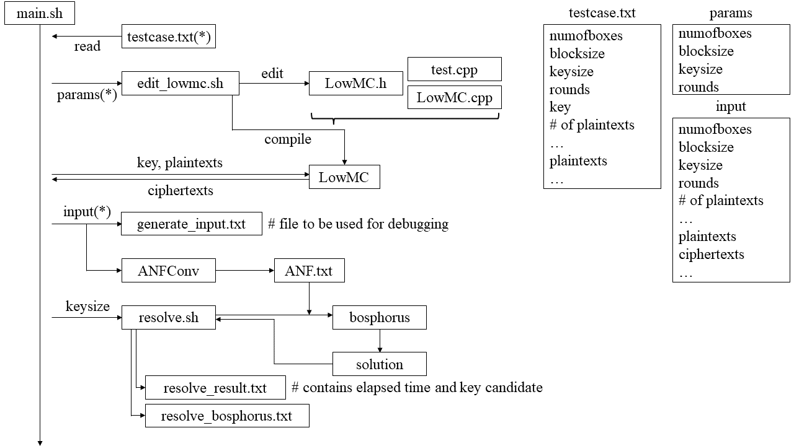

# Automation

초창기에는 손으로 데이터를 옮겨가며 실험했는데, 반복적인 작업이었는지라 20-046 박지훈 학생이 자동화 코드를 작성하였습니다. 

전체적인 흐름도는 아래와 같습니다. 



## `testcase.txt` 작성 방법
`testcase.txt`는 아래의 규칙에 따라 손으로 작성할 수도 있고, 후술할 `random_testcase.py`로 생성할 수도 있습니다. 

```
numofboxes
numofboxes
blocksize
keysize
rounds
key
# of plaintexts
...
plaintexts
...
```
현재로서는 `testcase.txt`의 마지막 줄에 개행을 하여야만 정상 작동하니 주의해야 합니다. 

## `random_testcase.py`

`numofboxes`, `blocksize`, `keysize`, `rounds`, `# of plaintexts`를 입력으로 받아 적당한 키와 평문을 만들어냅니다. 

## 참고한 자료

자동화 코드를 작성하기 위해 다양한 자료, 주로 Bash 문법과 관련된 것을 참고하였고, 이를 `references.md`에 정리하였습니다. 